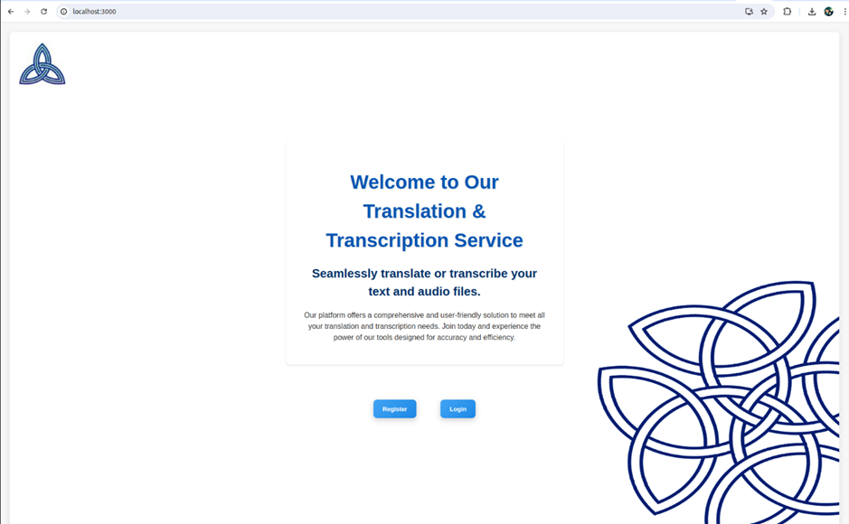

# Advanced Challenges in Web Technologies

This project was undertaken by Team 4 as part of the Advanced Challenges in Web Technologies module at the University of Surrey.

## What we have built
We have built an audio/text transcription and translation application.
This application makes use of 5 microservices, each with different functionalities. Users are able to upload their
own audio files to the application and receive a quick and reliable transcription. If the audio is in a foreign language,
then they can also translate it into their preferred language.

Users are then able to save their translations and transcriptions, so that they can refer back to them at a later date.

## How to run
```commandline
sudo docker compose up
```
This command will build 5 docker containers, that are all linked together. The build will typically take a few minutes, and will be faster using GPU.

Once all of the containers are built and running, navigate to the web address:
http://localhost:3000

The first translation/transcription, may take a couple of minutes, but afterwards, it will be faster. It will also be faster running on the GPU rather than CPU.

## Contributors
- Leonie Kennedy 
- Sacha Kennedy
- Jakub Jilek
- Miriam Paul
- Carlos Velez Redondo
